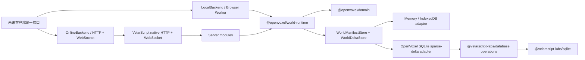

# OpenVoxel

OpenVoxel 是一个使用 VelarScript 从零构建体素世界的开源教学项目。它先完成没有前端也能独立验收的世界后端，再让浏览器单机模式和 Node 联机模式共享同一套领域核心。

当前完成的是后端世界生成纵向切片：创建世界后，`openvoxel:survival-v1` 会确定性生成气候、海岸、河流、丘陵、山地、洞穴、地下流体、七类矿物、地表和植被。生成的 16³ Chunk 随时可以由种子重建，不写入 SQLite；数据库只保存世界清单、被玩家改动的方块和对应 Chunk revision。联机服务使用 VelarScript 0.13 原生 ServeApp 与 WebSocket 宿主，HTTP 与 WebSocket 按业务模块进入同一个应用运行时；修改方块、重启恢复和广播继续走同一套用例。

## 开始使用

需要 Node.js 24 或更高版本。项目不使用 Bun。

```sh
npm install
npm run validate
npm start
```

服务默认监听 `http://127.0.0.1:3000`，SQLite 文件默认位于服务应用目录下的 `apps/server/openvoxel.sqlite`。监听地址、浏览器允许来源、协议限额和 SQLite 连接限额统一由 [`apps/server/config/server.yml`](apps/server/config/server.yml) 管理；相对配置路径和数据库路径都以服务应用目录解析。VelarScript 启动器与 npm workspace 脚本会把该目录设为工作目录；从其他目录直接运行构建物时，用绝对的 `OPENVOXEL_ROOT` 明确指定它。可以用 `OPENVOXEL_CONFIG` 选择另一份配置，并用 `OPENVOXEL_HOST`、`OPENVOXEL_PORT`、`OPENVOXEL_LOGGER`、`OPENVOXEL_DB` 覆盖部署相关值；密码、令牌等机密只能从部署环境注入，不进入 YAML。

```sh
curl http://127.0.0.1:3000/api/health

curl http://127.0.0.1:3000/api/client-contract

curl -X POST http://127.0.0.1:3000/api/worlds \
  -H 'content-type: application/json' \
  -d '{"id":"lesson-one","name":"Lesson One","seed":"openvoxel"}'

curl http://127.0.0.1:3000/api/worlds/lesson-one/bootstrap

curl -X POST http://127.0.0.1:3000/api/chunks/query \
  -H 'content-type: application/json' \
  -d '{"worldId":"lesson-one","position":{"x":0,"y":0,"z":0}}'

curl -X POST http://127.0.0.1:3000/api/generation/sample \
  -H 'content-type: application/json' \
  -d '{"worldId":"lesson-one","position":{"x":0,"z":0}}'
```

WebSocket 地址是 `ws://127.0.0.1:3000/api/events`，命令和事件都使用 MessagePack。完整契约见 [协议 v1](docs/protocol-v1.md)。

## 架构



仓库分层：

- `packages/domain`：坐标、Chunk、世界清单和确定性生成；不导入 Node 能力。
- `packages/blocks`：由 `data/blocks.yml` 生成的跨 Node/浏览器方块注册表；拥有稳定 ID、模拟属性和声明式渲染描述。
- `packages/protocol`：HTTP 和 MessagePack WebSocket 的应用协议、稳定路由常量与客户端接入契约。
- `packages/world-runtime`：创建世界、查询 Chunk、修改方块等用例和存储端口。
- `apps/server`：system、world、chunk、block、realtime 模块，以及拥有表结构、迁移 SQL 和稀疏世界规则的 SQLite 适配器与组合根。
- `@velarscript-labs/yaml`、`@velarscript-labs/database` 和 `@velarscript-labs/sqlite` 来自官方维护但不属于语言标准库的 VelarScript Libraries；OpenVoxel 不复制它们的通用边界，也不把游戏业务搬进这些库。
- VelarScript 官方工具链继续使用 `@velarscript/*`；Libraries 非标准包统一从公开 npm scope `@velarscript-labs/*` 安装。两个命名空间的所有权在依赖名上直接可见，并由 lockfile 固定版本与完整性。

目录按职责固定：手写运行时代码进入 `src/`，测试进入 `tests/`，测试辅助件进入 `tests/support/`，性能基准进入 `benchmarks/`，人工数据进入 `data/`，生成物进入 `generated/`，生成与检查脚本进入 `tools/`。`src/` 不放测试和生成物，`generated/` 禁止生成 `.vel`；`npm run structure:check` 和完整门禁会持续检查这两条规则。

应用边界和标准库晋升规则见 [ADR 0001](docs/architecture/0001-application-boundary.md)，Chunk 格式见 [ADR 0002](docs/architecture/0002-world-format-v1.md)，世界生成裁决见 [ADR 0004](docs/architecture/0004-survival-world-generation.md)，原生服务框架裁决见 [ADR 0010](docs/architecture/0010-native-velarscript-backend.md)，稀疏世界存储见 [ADR 0006](docs/architecture/0006-sparse-world-deltas.md)，YAML 配置与方块目录裁决见 [ADR 0007](docs/architecture/0007-yaml-configuration-and-block-catalog.md)，存档与目录兼容性见 [ADR 0008](docs/architecture/0008-world-block-catalog-compatibility.md)，客户端接入契约见 [ADR 0009](docs/architecture/0009-client-contract-boundary.md)。

生成性能基线可以独立运行：

```sh
npm run benchmark:worldgen
npm run benchmark:columns
npm run benchmark:caves
```

世界生成基线会生成固定的 192 个 Chunk，报告总耗时、平均耗时和聚合校验和；地形柱基线比较垂直层重复计算与 64 项水平 LRU 缓存；洞穴基线比较逐 Chunk 重放与有界计划缓存。两个专项基准都要求两条路径的聚合校验和相同，让性能变化与语义变化不会混在一起。

## 当前边界

当前阶段不包含渲染、玩家、登录、移动、物品、合成和进程内 Chunk 缓存。后端已经提供单 Chunk、最多 64 个 Chunk 的批量读取、方块目录和地形诊断接口；浏览器 Worker 适配器仍留到下一阶段。Chunk 缓存会在客户端访问模式有真实性能数据后再决定是否引入 `lru-cache`。

OpenVoxel 的业务代码不会写入 VelarScript 主仓库或 VelarScript Libraries。只有能力具备领域无关的稳定语义、已有真实复用证据，并能独立承担兼容与验证成本时，才会进入 Libraries；进入 Libraries 也不等于晋升为 `velar/*` 标准库。
