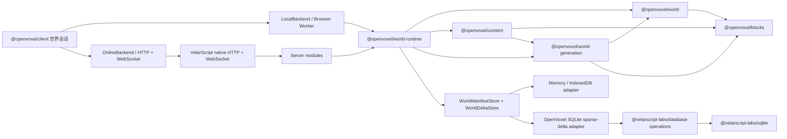

# OpenVoxel

OpenVoxel 是一个使用 VelarScript 从零构建体素世界的开源教学项目。它先完成没有前端也能独立验收的世界后端，再让浏览器单机模式和 Node 联机模式共享同一套世界模型、生成器和应用运行时。

当前完成的是可在单机与联机间复用的世界纵向切片：创建世界后，`openvoxel:survival-v2` 会确定性生成气候、海岸、河流、丘陵、山地、洞穴、地下流体、七类矿物、地表和植被。生成的 16³ Chunk 随时可以由种子重建；持久化层只保存世界清单、玩家形成的稀疏覆盖和对应 Chunk revision。联机服务使用 VelarScript 0.27.0 的声明式 ServeApp、WebSocket 路由和类型化实时会话，本地模式则在专用浏览器 Worker 中运行相同 `WorldRuntime`，并把清单和增量保存到 IndexedDB。

## 开始使用

需要 Node.js 24 或更高版本。项目不使用 Bun。

```sh
npm install
npm run validate
npm start
```

另开一个终端运行 Web 客户端：

```sh
npm run dev:web
```

访问 `http://127.0.0.1:7173` 后，可以在开始界面创建、打开和切换本地世界，再进入 Canvas 世界视图。生产预览固定使用 `7174`；无头浏览器验收使用独立的 `7273`–`7275` 端口，不会再与其他项目的常用开发端口争用。

服务默认监听 `http://127.0.0.1:3000`，SQLite 文件默认位于服务应用目录下的 `apps/server/openvoxel.sqlite`。项目显式激活 `@velarscript/server`，监听地址、浏览器允许来源、协议限额和 SQLite 连接限额统一由 [`apps/server/application.yml`](apps/server/application.yml) 管理；它的位置由 [`apps/server/velar.json`](apps/server/velar.json) 的 `server.configuration` 明确声明，开发、检查和生产构建使用同一入口。数据库与 Content Pack 的相对路径以服务应用目录解析；从其他目录直接运行构建物时，用绝对的 `OPENVOXEL_ROOT` 明确指定该运行时数据根。可以用 `OPENVOXEL_HOST`、`OPENVOXEL_PORT`、`OPENVOXEL_LOGGER`、`OPENVOXEL_DB` 覆盖部署相关值；密码、令牌等机密只能从部署环境注入，不进入应用配置。

```sh
curl http://127.0.0.1:3000/api/health

curl http://127.0.0.1:3000/api

curl -X POST http://127.0.0.1:3000/api/worlds \
  -H 'content-type: application/json' \
  -d '{"id":"lesson-one","name":"Lesson One","seed":"openvoxel"}'

curl http://127.0.0.1:3000/api/worlds/lesson-one/bootstrap

curl http://127.0.0.1:3000/api/worlds/lesson-one/content

curl -X POST http://127.0.0.1:3000/api/worlds/lesson-one/terrain/chunks \
  -H 'content-type: application/json' \
  -d '{"positions":[{"x":0,"y":0,"z":0},{"x":0,"y":1,"z":0}]}'

curl http://127.0.0.1:3000/api/worlds/lesson-one/terrain/samples/0/0

curl http://127.0.0.1:3000/api/openapi.json
```

每个连接通过 `ws://127.0.0.1:3000/api/worlds/{worldId}/realtime` 进入一个共享世界，命令和事件使用 MessagePack。完整契约见 [当前协议](docs/protocol.md)，可交互文档位于 `/api/docs`。

Mod 人工源与运行时产物分开构建：源目录包含 `content.yml`、`identities.yml` 以及可选的 `blocks/`、`world-generation/`，构建目录只接收 `content-pack.json`。服务器在 `application.yml` 的 `content.packArtifacts` 中安装产物，并用 `defaultPacks` 选择新世界默认内容。

```sh
OPENVOXEL_CONTENT_SOURCE=/absolute/mod-source \
OPENVOXEL_CONTENT_BUILD=/absolute/mod-build \
npm run compile:mod --workspace @openvoxel/content
```

## 架构



仓库按职责族群组织；族群目录只负责导航，每个叶目录仍是独立包：

- `packages/content/identities`：拥有跨目录逻辑身份、身份树合并与引用解析；它的 Core 声明表示可被所有目标消费。
- `packages/content/blocks`：分组方块 YAML 使用权威身份路径，并用唯一 JSON 产物发布编译目录；源码按 `definition`、`compiler`、`runtime` 分层，拥有规范状态键、UInt32 运行时 ID、每世界 Mod 注册表、有限状态和声明式组件契约。
- `packages/content/packs`：把一个 Mod 的共享身份、方块贡献和生成器贡献编译成独立 `content-pack.json`，并按精确哈希组合每世界内容集合。
- `packages/world/model`：坐标、Chunk 调色板和世界清单等稳定世界模型；只维护数据结构与不变量，不选择生成算法或编排存储。
- `packages/world/generation`：生成器注册入口与确定性生存生成算法；地形、洞穴、地下流体、矿物和植被按阶段分离，不负责后续 Tick 模拟。
- `packages/world/runtime`：创建世界、解析精确内容、读取固定地形、缓存活动世界增量、顺序提交原子批次和发布有序世界事件等用例与存储端口。
- `packages/client/access`：拥有客户端世界接入职责；世界会话、OnlineBackend、Worker/IndexedDB LocalBackend 共用一个 `WorldBackend` 端口和冷热 Chunk 合并状态机，包清单明确声明 Web/Desktop 与 `web` 能力。
- `packages/client/rendering`：拥有客户端呈现职责；资源包身份、运行时渲染目录、Chunk 邻域快照、网格生成和 Babylon 表面在一个包内，包清单明确声明 Web/Desktop 与 `web` 能力。
- `packages/protocol`：只拥有 HTTP 和 MessagePack WebSocket 的线上数据类型、协议版本与客户端接入事实；实际 HTTP 路由由服务端注解和 OpenAPI 共同描述。
- `apps/server`：system、world、chunk、block、realtime 模块，负责把领域值投影成协议响应；同时拥有当前表结构、世界注册表 JSON、稀疏世界规则的 SQLite 适配器与组合根。
- `apps/web`：面向当前世界能力的浏览器诊断应用；对 Online/Local 两种适配器验收创建、查找、Chunk 同步、方块修改、重连和持久化恢复。
- `@velarscript/server` 是显式激活的官方服务端应用扩展，负责应用配置、启动约定，以及类型化实时会话的一条有界发送队列、唯一 writer 和确定性清理；世界身份、MessagePack 命令、广播范围与错误码仍归 OpenVoxel。
- VelarScript 官方工具链继续使用 `@velarscript/*`；Libraries 非标准包统一从公开 npm scope `@velarscript-labs/*` 安装。两个命名空间的所有权在依赖名上直接可见，并由 lockfile 固定版本与完整性。

族群与包目录只按职责命名，运行环境写入各自的 `velar.targets` 与
`velar.requires.capabilities`。OpenVoxel 的可移植职责包统一声明
`targets: ["core"]`，表示 Core、Node、Web、Desktop 都能消费；客户端与渲染器
声明实际需要的 Web 宿主。当前使用的 Labs 清单也显式声明环境：YAML、Noise、
MessagePack、Database、SQL 覆盖全部目标且不要求宿主能力，SQLite 只支持 Node 并
要求 `node` 能力。`npm run structure:check` 会同时检查内部依赖与直接 Labs 依赖的
目标、能力和消费方是否兼容。

目录按职责固定：手写运行时代码进入 `src/`，测试进入 `tests/`，测试辅助件进入 `tests/support/`，性能基准进入 `benchmarks/`，人工数据进入 `data/`，生成物进入 `generated/`，生成与检查脚本进入 `tools/`。`src/` 不放测试和生成物，`generated/` 禁止生成 `.vel`；`npm run structure:check` 和完整门禁会持续检查这两条规则。

应用边界和标准库晋升规则见 [ADR 0001](docs/architecture/0001-application-boundary.md)，Chunk 格式见 [ADR 0002](docs/architecture/0002-world-format-v1.md)，世界生成裁决见 [ADR 0004](docs/architecture/0004-survival-world-generation.md)，原生服务框架裁决见 [ADR 0010](docs/architecture/0010-native-velarscript-backend.md)，稀疏世界存储见 [ADR 0006](docs/architecture/0006-sparse-world-deltas.md)，YAML 定义与 JSON 方块产物见 [ADR 0007](docs/architecture/0007-yaml-configuration-and-block-catalog.md)，每世界方块注册表见 [ADR 0008](docs/architecture/0008-world-block-registry.md)，客户端接入契约见 [ADR 0009](docs/architecture/0009-client-contract-boundary.md)，方块类型与有限状态地基见 [ADR 0011](docs/architecture/0011-block-type-and-state-foundation.md)，世界模型与生成边界见 [ADR 0012](docs/architecture/0012-world-model-and-generation-boundary.md)。

生成性能基线可以独立运行：

```sh
npm run benchmark:worldgen
npm run benchmark:columns
npm run benchmark:caves
```

世界生成基线会生成固定的 192 个 Chunk，报告总耗时、平均耗时和聚合校验和；地形柱基线比较垂直层重复计算与 64 项水平 LRU 缓存；洞穴基线比较逐 Chunk 重放与有界计划缓存。两个专项基准都要求两条路径的聚合校验和相同，让性能变化与语义变化不会混在一起。

## 当前边界

世界后端、客户端会话、OnlineBackend 和 LocalBackend 已形成完整闭环：服务端提供最多 64 个固定地形 Chunk 的批量读取、每世界内容目录、地形诊断、按世界隔离的热增量同步与最多 1024 项的原子方块编辑；浏览器端用真实 HTTP、WebSocket、MessagePack、Worker 与 IndexedDB 证明两种模式的共享语义。客户端资源包和最小体素呈现也已接入：少量已同步 Chunk 会生成可更新网格，显示资源只通过内容目录中的逻辑 material、texture、model 与 tint key 解析；一个逻辑 texture 可以在资源包构建期组合多层贴图并生成带权重的稳定表面变体，世界运行时 ID 始终不承担纹理或模型身份。

OpenVoxel 的业务代码不会写入 VelarScript 主仓库或 VelarScript Libraries。只有能力具备领域无关的稳定语义、已有真实复用证据，并能独立承担兼容与验证成本时，才会进入 Libraries；进入 Libraries 也不等于晋升为 `velar/*` 标准库。
