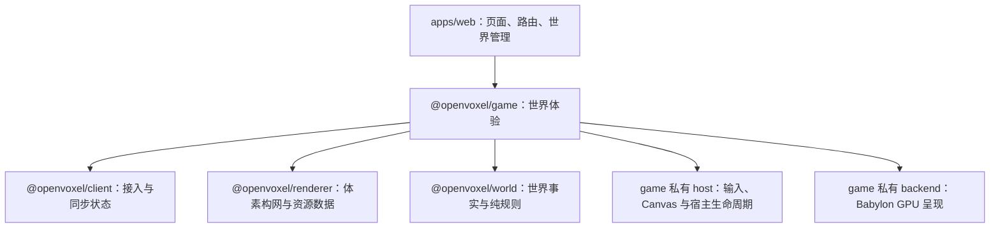

# ADR 0015：OpenVoxel 游戏框架

状态：已接受

## 裁决

`@openvoxel/game` 是 OpenVoxel 专用的客户端游戏框架，位于 `packages/client/game`。
它把世界接入、玩家探索、Chunk 呈现、环境效果和宿主资源组织成一次有明确所有者的世界体验。
公开契约以 OpenVoxel 的世界和玩家用例命名，包内按职责组织，运行环境由包清单声明。

世界页通过 game 进入和退出世界，并消费状态与诊断事实。game 组合 client、renderer 和 world：

开始界面与世界管理仍使用 Web 扩展构建 DOM 页面；世界页建立游戏体验后才获取 Canvas、
输入监听器、Worker 和 GPU 资源。页面不直接组装流送器、构网队列、天气系统或 Babylon 对象。

## 职责与目录

| 所有者 | 职责 | 边界 |
| --- | --- | --- |
| `apps/web` | 开始界面、创建与管理世界、路由、HUD 展示 | 进入世界使用 game 的用例，不持有帧循环或 GPU 对象 |
| `game/src/runtime/world-experience.vel`、`local-world-game.vel` | 会话、首屏准备和游戏实例的阶段获取与回收；本地后端与 Canvas 组装 | 一次进入拥有一次体验；重复进入和关闭分别共享自己的完成 |
| `game/src/runtime/` | 世界游戏组合、视区流送、构网协调、Worker 调度、环境采样、统计与 readiness | 拥有需求、队列和 ticket；同步后的方块事实来自 client |
| `game/src/controls/` | Creative 飞行、Survival 步行、玩家状态与相机控制策略 | 消费输入意图与碰撞查询，纯策略可脱离 DOM/GPU 测试 |
| `game/src/host/` | Canvas、键鼠输入、焦点、指针锁及宿主监听器 | 把宿主事件转成受检数据；持有宿主对象和监听器的生命周期 |
| `game/src/graphics/` | OpenVoxel 图形契约、资源提交、世界环境到呈现帧的投影 | 以 Chunk、材质、相机和环境语义连接运行时与具体后端 |
| `game/src/backends/babylon/` | Engine、Scene、相机、材质、纹理、阴影、天气 GPU 效果及恢复 | 私有 `.vel` 边界与 `.mjs` 实现；负责实际 GPU 获取、提交和释放 |
| `@openvoxel/renderer` | 渲染目录、资源身份与资源包、邻域快照、纯体素构网、Portal 摘要与缓冲区契约 | 不获取 Canvas、输入、世界会话或 GPU 资源 |
| `@openvoxel/client` | WorldBackend、连接代际、冷热 Chunk 组合、请求关联、广播重放、权威环境锚点 | 不决定画面、玩家控制或 GPU 可见性 |
| `@openvoxel/world` 与 `@openvoxel/world-runtime` | 世界不变量、时间与气候规则、生态方块及持久化用例 | 地面冰雪和碰撞事实不会由视觉效果反向生成 |

表中 game 内目录均以 `packages/client/game` 为根。资源人工定义、资源生成器与生成产物
继续归 renderer；game 消费经过校验的资源数据并拥有其运行期 GPU 实例。
构网算法与构网调度是不同职责：renderer 计算给定快照的网格，game 决定何时计算、
是否仍需提交、何时移除已安装网格。

## 依赖与公开契约

1. 世界体验调用方向固定为 `apps/web → game → client / renderer / world`。
   首页管理可以消费客户端管理用例，但不得绕过 game 获取运行中的图形或控制对象。
2. renderer 的运行时代码保持 Core 可消费的纯数据与纯计算；构网 Worker 使用精确的
   `@openvoxel/renderer/meshing-worker` 入口，Worker 获取和消息生命周期由 game 拥有。
3. game、client 的清单声明实际使用的宿主能力。目录名称表达职责，能力声明表达可执行环境；
   纯移动或资源计算模块的可测试性不等于整个宿主包可以声明 Core。
4. game 的公开入口提供 `openLocalWorldGame`、`WorldGameExperience` 和 `WorldGameStats`；
   页面调用体验的 `enter` / `close` 并消费状态，后端、会话和首批 Chunk 由 game 获取。
   `Scene`、`Mesh`、Babylon 类型与 `unknown` 原生句柄不进入公开入口；
   页面不能取得任意 native 对象再修改其字段。内部跨 JS 调用通过受检 `extern module` 声明。
5. 私有后端端口按 OpenVoxel 的网格提交、环境应用、观察状态和释放语义定义，
   不按 Babylon 类逐一复制接口。后端替换不改变方块编号、资源 key、世界协议或游戏规则。
6. CPU 网格用有界 typed buffer 批量交接。方块 runtimeId、资源逻辑 key、生成 bank layer
   与 GPU 对象身份各有自己的生命周期；后端不得把它们合成一个全局编号。

## 帧与时间语义

一个游戏实例拥有一个帧循环。宿主输入、玩家推进、视点变化、预算内的 GPU 提交、
透明排序、材质动画、环境更新与最终绘制由该实例按确定顺序执行；后端的具体帧驱动
属于这份所有权，子系统不另起独立绘制循环。帧内上传、排序、阴影与天气工作继续有固定预算。

时间分为三类明确语义：

- 世界时间：world/runtime 定义并持久化原点；client 根据权威样本和单调时钟推进，
  重连安装新锚点。昼夜、季节、自然冰雪与闪电身份使用这条时间线。
- 玩家积分时间：来自游戏帧的单调间隔，使用控制策略规定的步长上限。
  页面暂停后的长间隔不能一次积分成玩家瞬移，也不能通过改写世界时间消除。
- 视觉推进时间：game 用当前权威世界时间和帧间隔驱动呈现插值与效果。
  同一环境样本重复应用保持幂等；闪电年龄取权威事件时间差，
  云的风位移只对新的样本区间积分，动画更新不重建 Chunk。

暂停、恢复、长帧和时间回退需要各自明确处理。调整积分算法、刷新节拍或时间锚点
属于行为变更，应独立验证，不能混入目录迁移。

## 生命周期与关闭顺序

世界体验先取得会话，再准备已同步首屏 Chunk，最后取得游戏图形与后台工作。
图形对象创建成功不代表首屏已经就绪：readiness 需要首屏所需网格的真实提交结果；
碰撞 readiness 则只接受已经完成冷热同步的 Chunk。未知区域继续保守阻挡。

正常退出、初始化失败和页面取消共用以下所有权顺序：

1. 同步撤销体验和游戏实例的继续运行权，封住入口、统计回调、订阅与新任务；
   停止帧和输入接收，归还当前实例拥有的指针锁。
2. 向环境、生态刷新、流送和构网任务发出取消。令牌贯穿 client 的同步请求与后端传输，
   任务收敛不能依赖稍后才执行的 Session 关闭。
3. 取消尚未提交的 GPU 上传并让等待者得到终态，释放图形后端及宿主资源，
   然后等待已拥有的后台任务回收。不能先等待上传任务、再释放唯一能够唤醒它的队列。
4. 体验在游戏实例回收后关闭会话，再关闭它自己取得的 WorldBackend。
   每一项清理失败仍继续后续清理；重复关闭共享同一次完成。

异步获取在每次恢复后检查发起者是否仍拥有结果。初始化期间关闭后，迟到取得的
会话、纹理、图形实例和指针锁只能释放自身资源，不能推进下一阶段或影响后来进入的世界。
这些局部获取任务继续承担迟到回收，即使页面已经结束等待。

网格 ticket 在游戏实例内单调且不复用。GPU 已安装与内容仍有效分别记录；取消 Worker
不等于移除 GPU 网格。流送批次成功后先执行配对卸载，再处理更新的视窗需求，
保持当前驻留上限与窗口连续性。相关数值与算法约束见 [ADR 0013](0013-client-world-rendering.md)。

## Babylon 与定向实现

默认后端复用 Babylon 的相机、材质、纹理、阴影、资源恢复和绘制能力。
OpenVoxel 实现自己的世界规则、体素构网、资源编译、流送协调，以及有明确证据的
体素性能或效果补充，例如跨 Chunk 面剔除、纹理数组材质接入、透明体素面排序、
局部阴影预算和天气地表查询。

新增定向实现必须先说明现有能力的具体缺口，给出可复现画面或性能证据，
并把调整限定在对应所有者内。成熟能力的配置与组合足以解决时，使用既有实现。
游戏框架不为潜在外部游戏预设一套对象模型、插件系统或通用引擎接口。

## 后端替换与验收

替换后端首先替换 game 的私有适配，不要求页面、client、renderer 或世界包理解新引擎。
适配器必须满足相同的数据边界、资源预算、提交结果、上下文恢复和生命周期语义。
设备支持的纹理数组层数、格式与采样能力须在创建纹理、材质和网格前检查；能力不足必须明确失败，
不能通过默默省略材质通道、降水遮挡或方块状态获得通过。

后端验收同时包括：

- 纯契约测试：真实 Chunk 数据的提交、替换、移除、迟到完成、上传取消、资源失败回收；
  通过可控任务和时间检验调度顺序，不依赖 GPU 才能覆盖生命周期。
- 真实 GPU 测试：完整方块状态目录、四通道材质与纹理层、cutout 和透明深度、
  天空与天气、阴影、动画、上下文丢失恢复及卸载后的零残留。
- 真实体验测试：从产品世界页进入，指针锁与移动、创建阶段退出、重连、
  首屏 readiness，以及长距离探索的驻留和队列上限。

GPU 探针归 game，在临时服务和独立测试夹具中运行；renderer 继续负责资源生成与
纯构网验收。探针必须复用生产契约和后端，不注册产品测试页面。
效果差异使用有意义的图像度量与人工复核；生命周期、资源身份与世界事实要求严格一致。
生产帧预算必须在真实硬件后端验证，软件光栅后端只证明正确性与工作量有界。

## 后续扩展

新的探索交互或玩家模式先进入 game 的对应职责模块；持久化和多人权威规则进入
world/runtime 与协议；新方块模型、资源配方和面规则进入 renderer；新宿主与图形
实现进入 game 的私有 host/backend。页面扩展只处理导航、表单与展示。

新增顶层公开 API 需要一个实际 OpenVoxel 调用者和清晰所有者，新增包需要独立职责与
真实复用边界。先通过现有目录组织相关模块，再根据已经出现的需求决定是否拆包。
宿主或引擎细节不能通过新增公共句柄逃离其所有者。

VelarScript 能力缺口仍优先在语言侧修复；项目内的 JS 适配负责宿主和成熟库接入，
不复制一套语言语义。模块归属与异步验证规则见 [ADR 0014](0014-module-ownership.md)。
