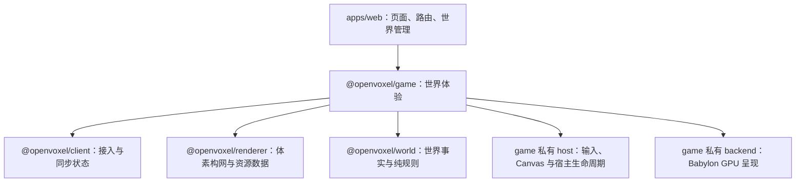

# ADR 0015：OpenVoxel 游戏框架

状态：已接受

## 裁决

`@openvoxel/game` 是 OpenVoxel 专用的客户端游戏框架，位于 `packages/client/game`。
它把世界接入、玩家探索、Chunk 呈现、环境效果和宿主资源组织成一次有明确所有者的世界体验。
公开契约以 OpenVoxel 的世界和玩家用例命名，包内按职责组织，运行环境由包清单声明。

世界页通过 game 进入和退出世界，并消费状态与诊断事实。game 组合 client、renderer 和 world：

开始界面与世界管理仍使用 Web 扩展构建 DOM 页面；世界页建立游戏体验后才获取 Canvas、
输入监听器、Worker 和 GPU 资源。页面不直接组装流送器、构网队列、天气系统或 Babylon 对象。

## 职责与目录

| 所有者 | 职责 | 边界 |
| --- | --- | --- |
| `apps/web` | 开始界面、创建与管理世界、路由、HUD 展示 | 进入世界使用 game 的用例，不持有帧循环或 GPU 对象 |
| `game/src/runtime/world-experience.vel`、`local-world-game.vel` | 会话、首屏准备和游戏实例的阶段获取与回收；本地后端与 Canvas 组装 | 一次进入拥有一次体验；重复进入和关闭分别共享自己的完成 |
| `game/src/runtime/` | 世界游戏组合、视区流送、构网协调、Worker 调度、环境采样、统计与 readiness | 拥有需求、队列和 ticket；同步后的方块事实来自 client |
| `game/src/controls/` | Creative 飞行、Survival 步行、玩家状态与相机控制策略 | 消费输入意图与碰撞查询，纯策略可脱离 DOM/GPU 测试 |
| `game/src/host/` | Canvas、键鼠输入、焦点、指针锁及宿主监听器 | 把宿主事件转成受检数据；持有宿主对象和监听器的生命周期 |
| `game/src/graphics/` | OpenVoxel 图形契约、资源提交、世界环境到呈现帧的投影 | 以 Chunk、材质、相机和环境语义连接运行时与具体后端 |
| `game/src/backends/babylon/` | Engine、Scene、相机、材质、纹理、阴影、天气 GPU 效果及恢复 | 私有 `.vel` 边界与 `.mjs` 实现；负责实际 GPU 获取、提交和释放 |
| `@openvoxel/renderer` | 渲染目录、资源身份与资源包、邻域快照、纯体素构网、Portal 摘要与缓冲区契约 | 不获取 Canvas、输入、世界会话或 GPU 资源 |
| `@openvoxel/client` | WorldBackend、连接代际、冷热 Chunk 组合、请求关联、广播重放、权威环境锚点 | 不决定画面、玩家控制或 GPU 可见性 |
| `@openvoxel/world` 与 `@openvoxel/world-runtime` | 世界不变量、时间与气候规则、生态方块及持久化用例 | 地面冰雪和碰撞事实不会由视觉效果反向生成 |

表中 game 内目录均以 `packages/client/game` 为根。资源人工定义、资源生成器与生成产物
继续归 renderer；game 消费经过校验的资源数据并拥有其运行期 GPU 实例。
构网算法与构网调度是不同职责：renderer 计算给定快照的网格，game 决定何时计算、
是否仍需提交、何时移除已安装网格。

## 依赖与公开契约

1. 世界体验调用方向固定为 `apps/web → game → client / renderer / world`。
   首页管理可以消费客户端管理用例，但不得绕过 game 获取运行中的图形或控制对象。
2. renderer 的运行时代码保持 Core 可消费的纯数据与纯计算；构网 Worker 使用精确的
   `@openvoxel/renderer/meshing-worker` 入口，Worker 获取和消息生命周期由 game 拥有。
3. game、client 的清单声明实际使用的宿主能力。目录名称表达职责，能力声明表达可执行环境；
   纯移动或资源计算模块的可测试性不等于整个宿主包可以声明 Core。
4. game 的公开入口提供 `openLocalWorldGame`、`WorldGameExperience` 和 `WorldGameStats`；
   页面调用体验的 `enter` / `close` 并消费状态，后端、会话和首批 Chunk 由 game 获取。
   `Scene`、`Mesh`、Babylon 类型与 `unknown` 原生句柄不进入公开入口；
   页面不能取得任意 native 对象再修改其字段。内部跨 JS 调用通过受检 `extern module` 声明。
5. 私有后端端口按 OpenVoxel 的网格提交、环境应用、观察状态和释放语义定义，
   不按 Babylon 类逐一复制接口。后端替换不改变方块编号、资源 key、世界协议或游戏规则。
6. CPU 网格用有界 typed buffer 批量交接。方块 runtimeId、资源逻辑 key、生成 bank layer
   与 GPU 对象身份各有自己的生命周期；后端不得把它们合成一个全局编号。

## 游戏偏好与实时设置

- `game/src/settings/` 持有偏好契约、默认值、范围约束、持久化及订阅；Web 面板通过公开 API 修改偏好。
  宿主保存键为 `openvoxel.settings.v1`，存储失败时当前调整继续生效并在设置页显示错误。
- 世界页提供画面、声音、操作、界面、环境五类设置。进入游戏后左上角齿轮打开屏幕居中的浅色设置面板，
  打开时释放指针锁；面板即时应用，恢复默认需要再次点击确认。
- 图形实例、输入、音频及世界运行时各自订阅并在关闭时释放订阅。渲染精度受原有像素预算约束；
  视距改变同一流送窗口的半径（3–8 区块），继续保留碰撞安全区及卸载迟滞。
  画质预设仅修改渲染选项。重复键位交换绑定，修改输入设置后清除旧的按下状态。
- 音频按主音量、交互音效、环境音效实时混合，后台静音同时响应页面可见性和窗口焦点。
  界面开关控制小地图、准星与方块栏；关闭小地图同时停止地图绘制和额外地形需求。
- 环境页提供客户端昼夜、天气、风力和远景雾预览；自动模式跟随权威环境。
  预览保留世界时间与采样位置，冰雪生态仍由世界运行时推进。
- `npm run test:web-settings` 构建并验证实际世界中的设置、刷新恢复、窄屏、昼夜像素变化及退出回收；
  截图和结果进入 `apps/web/generated/settings-acceptance/`。

## 帧与时间语义

一个游戏实例拥有一个帧循环。宿主输入、玩家推进、视点变化、预算内的 GPU 提交、
透明排序、材质动画、环境更新与最终绘制由该实例按确定顺序执行；后端的具体帧驱动
属于这份所有权，子系统不另起独立绘制循环。帧内上传、排序、阴影与天气工作继续有固定预算。

时间分为三类明确语义：

- 世界时间：world/runtime 定义并持久化原点；client 根据权威样本和单调时钟推进，
  重连安装新锚点。昼夜、季节、自然冰雪与闪电身份使用这条时间线。
- 玩家积分时间：来自游戏帧的单调间隔，使用控制策略规定的步长上限。
  页面暂停后的长间隔不能一次积分成玩家瞬移，也不能通过改写世界时间消除。
- 视觉推进时间：game 用当前权威世界时间和帧间隔驱动呈现插值与效果。
  同一环境样本重复应用保持幂等；闪电年龄取权威事件时间差，
  云的风位移只对新的样本区间积分，动画更新不重建 Chunk。

暂停、恢复、长帧和时间回退需要各自明确处理。调整积分算法、刷新节拍或时间锚点
属于行为变更，应独立验证，不能混入目录迁移。

## 环境材质与水体

- renderer 在构网时使用一格邻域计算实体方块四角遮蔽，并选择平滑的三角形对角线；
  这份遮蔽随方块数据更新，跨 Chunk 使用相同世界邻居。透明体和植物不作为实体遮蔽物。
- 原始像素贴图保存在 data；资源构建按岩石、草、土、木材和叶片生成法线与粗糙度通道。
  game 使用克制的介电反光、ACES 曝光、轻度去饱和、FXAA 和半分辨率微弱泛光。
  地面受雨后湿润度影响，湿润和干燥按帧间隔平滑推进。
  生物群系和树种底色经过材质角色校色：草地为柔和草甸绿、草株较明亮、树冠较深且偏冷；
  保留植被中间色亮度与适量饱和度，全局去饱和仅为 -5，避免两层校色叠加成灰暗绿色。
  春季端点保持柔和，秋季树种颜色继续独立变化。草叶的湿润粗糙度保持在 0.86 左右，
  多孔土石按原始粗糙度保留漫反射质感，避免整片草地出现湿塑料反光。
- 水面法线来自连续世界坐标的多尺度二维高度梯度，并叠加资源法线；风与流体流动状态控制幅度和速度。
  每一层波纹按屏幕像素覆盖的世界尺寸过滤，掠射角收敛到平均水面法线，避免平行亮条。
  最近可见水位共享反射、折射两张目标，尺寸为主画面的一半，上限 768×512，周围 96 格内
  的不透明地形参与采集。水位选择与采集列表每 200 ms 更新；相机移动时逐帧采集，静止时
  最多每秒采集 15 次。相机、投影、水位、地形和上下文恢复会立即刷新采集；水面法线仍逐帧动画。
  其他水位使用环境光反射与透明混合。小地图使用自己的相机，不采样主相机的投影纹理。
- 水体采集排除流体、天气与天体光斑，避免反馈、重复太阳高光和透明排序竞争。
  同水位的水面采用深度吸收、视角相关反射与扰动后的湖底图像合成；扰动通过世界坐标投影，
  随距离和相机方向缩放，并在采集边缘收敛，避免拉伸边缘像素。
  采集与图形实例共用生命周期，离开可见水面停止采集，窗口变化重新分配有界目标。
- world/generation 的 hydrology 配置分别控制湖泊和小水坑。种子决定盆地、岸圈与水平水位；
  密度、填水、道路、洞穴和植被使用同一份列计划。盆地跨区块连续，洞口保护湖床，
  小水坑的完整岸圈避开湖泊。生成算法身份与这些规则一起更新。
- 藤蔓使用独立的 vine 材质与连续世界坐标风场，整串沿支撑面切向轻摆，连接处共享位移。
  小草仍按根部到叶尖弯曲；藤蔓不使用每格重置的 UV 高度权重。

## 天空光与局部光源

- renderer 从方块 `light.opacity / emission / skylight` 编译光照目录；`lighting.vel` 是
  CPU 体素光场的类型边界，`lighting-worker` 是独立计算入口。game 的 `world-lighting.vel`
  拥有一个 Worker、100 ms 变更合并和一个在途请求，退出世界取消并释放。
- 光场保存直接天空光、绕过洞口的漫射天空光和方块光三个 0–15 通道。实体截断传播，
  叶片、水、冰按各自透光参数衰减；发光方块通过六邻域传播，移除光源或新增墙体重建有效种子。
  水平方向只重算变更列及 14 格传播范围覆盖的邻列，垂直方向跟随整个驻留列；没有变更时不扫描。
  回归测试将局部更新结果逐字节与完整重算比较，覆盖跨区块、封顶、光源移除和阻光修改。
- 每个区块的光场附带一格 halo。后端按实际绘制需求创建 18³ RGBA 纹理，顶点在表面外侧取样并插值，
  调制直接光、半球光、环境反射和大气雾。几何和光场独立更新，昼夜变化不重新构网。
  新网格等到光场就绪再淡入；淡出中的网格保持其光场，最后一个使用者释放后回收已卸载区块的纹理。
- 光照以已同步体素为依据：未知侧面不注入光，已知但卸载的上层实体屋顶保留列摘要。
  垂直加载空隙按已知屋顶判断遮挡，单独到达的高空空气区块不会把下方晴天地表临时变黑。
  首次进入一个列时，从最高驻留区块的顶部注入天空光；尚未同步且从未观察过的更高地形不在遮挡依据内。
  将来无限纵向洞穴或更稀疏流送需要服务端提供完整天空可见性摘要，不能把这一边界误当成完整世界烘焙。
- 最近两个发光源使用暖色 PBR 点光源、距离衰减与缓存的 256 立方体阴影；每个点光源只收集附近网格。
  所有发光方块仍贡献光场。密集熔岩按 4 格单元选点光源代表；地形变化和动画遮挡物才刷新对应投影。
  火把后续通过方块的透光/发光配置接入同一链路。
- 昼夜以太阳高度连续映射，正午直射增强，月光保留月相差异，夜间环境填充降低；照明颜色和强度以
  180 ms 指数过渡跟随环境样本，闪电事件保持即时。日照接近零时暂停太阳阴影采集。
- `OPENVOXEL_GPU_SCENE=lighting npm run test:gpu:built` 使用真实封闭洞室验证天窗、封顶、局部照明、
  石墙阻光以及昼夜差异。`npm run benchmark:lighting --workspace @openvoxel/renderer` 记录驻留场景的计算开销。
- `OPENVOXEL_GPU_SCENE=lighting-streaming npm run test:gpu:built` 验证空中区块乱序到达时亮度稳定，
  并逐帧检查相同网格替换，防止区块加载导致整片地面闪黑。

## 屏幕绘制预算

- 主画面跟随屏幕 RAF 节拍，每次刷新处理输入和位移；窗口失焦后暂停绘制，恢复时继续使用受限积分步长。
- 主画面最多 360 万像素、像素倍率最多 2，按窗口面积连续计算。普通分辨率保持原倍率；
  HUD 和小地图的尺寸独立于主画面预算。视距、资源纹理、阴影与水体采集尺寸规则保持原有档位。
- 窗口尺寸变化才重算主画面倍率，避免随瞬时帧率反复缩放引起纹理闪烁。
- 水体采集注册为主相机目标，在本帧阴影贴图完成后绘制；小地图随后采集，保证光源矩阵与阴影深度一致。
  视野外保留附近水域的采集与混合状态，暂停刷新；重新进入视野时按当前相机立即采集。
- `OPENVOXEL_GPU_SCENE=render-budget npm run test:gpu:built` 检查 Retina 像素预算、实际绘制节拍、
  静止/移动水体采集次数和失焦/恢复。macOS 使用 Metal；该实时场景单独运行，常规图像测试允许软件 WebGL。

## 区块呈现过渡

- 数据与网格离开需求后分别缓冲 800 ms，再进入实际回收和淡出；短暂转身回退直接复用现有内容。
  数据缓冲最多 64 个区块，网格缓冲最多 128 个区块，超过上限才提前淘汰最老的过期项。
  回收时复核最新视窗，过期加载批次不能卸载新视窗需要的区块；空队列不轮询，关闭世界取消延迟任务。
- 初次提交按 280 ms 淡入，卸载按 220 ms 淡出。像素覆盖率保留实体的深度写入与材质排序；
  稳定网格直接完整绘制，替换网格继承当前进度。卸载立即退出碰撞、天气采样、小地图和阴影登记，
  剩余视觉网格由过渡所有者释放，最多保留 128 个淡出网格；关闭表面立即释放全部资源。
- Worker 构网时把世界内部尚未加载的面邻域延续为中心边界，避免生成短暂的截面墙。
  世界高度外提供真实空气视图；已加载空气与未知邻块分开处理。邻居到达后重建真实外露面。
- Portal 摘要先参与需求计算，再进入 GPU 上传队列；队列在提交帧复核 ticket、驻留状态与需求。
  过期结果不替换现有网格，后续正确结果再提交。首屏所有权持续到有效提交。

## 生命周期与关闭顺序

世界体验先取得会话，再准备已同步首屏 Chunk，最后取得游戏图形与后台工作。
图形对象创建成功不代表首屏已经就绪：readiness 需要首屏所需网格的真实提交结果；
碰撞 readiness 则只接受已经完成冷热同步的 Chunk。未知区域继续保守阻挡。

正常退出、初始化失败和页面取消共用以下所有权顺序：

1. 同步撤销体验和游戏实例的继续运行权，封住入口、统计回调、订阅与新任务；
   停止帧和输入接收，归还当前实例拥有的指针锁。
2. 向环境、生态刷新、流送、光照和构网任务发出取消。令牌贯穿 client 的同步请求与后端传输，
   任务收敛不能依赖稍后才执行的 Session 关闭。
3. 取消尚未提交的 GPU 上传并让等待者得到终态，释放图形后端及宿主资源，
   然后等待已拥有的后台任务回收。不能先等待上传任务、再释放唯一能够唤醒它的队列。
4. 体验在游戏实例回收后关闭会话，再关闭它自己取得的 WorldBackend。
   每一项清理失败仍继续后续清理；重复关闭共享同一次完成。

异步获取在每次恢复后检查发起者是否仍拥有结果。初始化期间关闭后，迟到取得的
会话、纹理、图形实例和指针锁只能释放自身资源，不能推进下一阶段或影响后来进入的世界。
这些局部获取任务继续承担迟到回收，即使页面已经结束等待。

网格 ticket 在游戏实例内单调且不复用。GPU 已安装与内容仍有效分别记录；取消 Worker
不等于移除 GPU 网格。流送批次成功后交付配对回收计划，再处理更新的视窗需求；
回收队列依据最新视窗撤销过期卸载，并限制缓冲容量。相关算法约束见 [ADR 0013](0013-client-world-rendering.md)。

## Babylon 与定向实现

默认后端复用 Babylon 的相机、材质、纹理、阴影、资源恢复和绘制能力。
OpenVoxel 实现自己的世界规则、体素构网、资源编译、流送协调，以及有明确证据的
体素性能或效果补充，例如跨 Chunk 面剔除、纹理数组材质接入、透明体素面排序、
局部阴影预算和天气地表查询。

新增定向实现必须先说明现有能力的具体缺口，给出可复现画面或性能证据，
并把调整限定在对应所有者内。成熟能力的配置与组合足以解决时，使用既有实现。
游戏框架不为潜在外部游戏预设一套对象模型、插件系统或通用引擎接口。

## 天气、风与自然群落

`game/src/environment/weather-dynamics.mjs` 保存纯数值的阵风包络和连续天气参数，
供图形与 Web 音频适配共同使用。雨雪分为小、中、大、暴风四档，档位用于诊断；
大小、透明度、下落速度和飘动参数连续插值。草尖、树叶、整串藤蔓、水波、落叶
和风声共享世界坐标与世界时间的阵风节奏。根部保持固定，藤蔓的连接面保持连续。

雨雪仍使用最多 149 列、每列 4 个槽及固定溅落池。粒子顺风跨过体素边界，
碰撞查询复用已缓存的目的地列；未知落点直接回收，近镜头淡出。雪花保留固定
图集槽和单体尺寸差异，并增加缓慢飘动。每帧只上传活动顶点前缀；上下文恢复时
从拥有的完整 CPU 数组恢复容量。自然植被的 GPU 摆动不增加逐株 CPU 更新。
地面交叉植物的朝向与高矮在 Worker 构网时按世界坐标确定，保持两个面的成本、
格内边界和固定根部高度；作物生长时朝向不变，连续水草仍使用完整高度。

自然地表采用有留白的连续斑块；绿色棉花适应温暖湿润草甸，天然黑麦停在绿色
阶段。生存生成器的自然生长候选把棉花上限设为 1、黑麦设为 5；玩家种植仍由
方块声明的完整生长阶段驱动，得到白棉及成熟谷物。水草按水深和底质进入湖泊、
水塘和河流，底栖海生物继续受盐水条件约束。

光照工作线程比较 opacity、emission、directLoss；只有贴图或作物年龄变化时，
复用既有光场，避免生态时间槽触发无意义的传播与纹理上传。

针对性视觉验收：`OPENVOXEL_WEATHER_GRADES=1 OPENVOXEL_GPU_SCENE=rain-eye npm run test:gpu:built`
及同命令的 `snow-eye` 场景，检查四档画面、粒子上限与资源释放。

## 后端替换与验收

替换后端首先替换 game 的私有适配，不要求页面、client、renderer 或世界包理解新引擎。
适配器必须满足相同的数据边界、资源预算、提交结果、上下文恢复和生命周期语义。
设备支持的纹理数组层数、格式与采样能力须在创建纹理、材质和网格前检查；能力不足必须明确失败，
不能通过默默省略材质通道、降水遮挡或方块状态获得通过。

后端验收同时包括：

- 纯契约测试：真实 Chunk 数据的提交、替换、移除、迟到完成、上传取消、资源失败回收；
  通过可控任务和时间检验调度顺序，不依赖 GPU 才能覆盖生命周期。
- 真实 GPU 测试：完整方块状态目录、四通道材质与纹理层、cutout 和透明深度、
  天空与天气、阴影、动画、上下文丢失恢复及卸载后的零残留。
- 真实体验测试：从产品世界页进入，指针锁与移动、创建阶段退出、重连、
  首屏 readiness，以及长距离探索的驻留和队列上限。

GPU 探针归 game，在临时服务和独立测试夹具中运行；renderer 继续负责资源生成与
纯构网验收。探针必须复用生产契约和后端，不注册产品测试页面。
效果差异使用有意义的图像度量与人工复核；生命周期、资源身份与世界事实要求严格一致。
生产帧预算必须在真实硬件后端验证，软件光栅后端只证明正确性与工作量有界。

## 后续扩展

Creative 的准星射线在 game 中沿已同步体素逐格查找，遇到未知 Chunk 即停止；
Web 宿主只交付鼠标按钮、数字键、相机位置和朝向。game 将挖掘与放置转换为
`ClientWorldSession.applyBlocks`，由既有世界命令、增量存储和会话变化事件驱动
持久化、碰撞与网格更新。快捷栏使用世界内容目录的状态键解析本世界 runtimeId，
不在客户端假定内建数字 ID。关闭世界时等待已发出的编辑收敛。
`creative-editing.vel` 持有选中、目标、错误与在途写入；`world-game.vel` 只连接
已同步方块查询、会话写入和关闭顺序。Web 导航适配的指针锁、按键映射、移动推进
与视区通知分别由 `navigation-pointer-lock.mjs`、`navigation-keyboard.mjs`、
`navigation-movement.mjs` 和 `navigation-view.mjs` 承担，公开导航端口保持统一。
快捷栏条目由 game 的 `data/creative-palette.json` 定义状态键与逻辑纹理键；
game 的构建资源入口从 renderer 公开的资源包数据提取预览图，Web 只消费 game
提供的预览产物。预览图使用资源包首个纹理变体。

新的探索交互或玩家模式先进入 game 的对应职责模块；持久化和多人权威规则进入
world/runtime 与协议；新方块模型、资源配方和面规则进入 renderer；新宿主与图形
实现进入 game 的私有 host/backend。页面扩展只处理导航、表单与展示。

新增顶层公开 API 需要一个实际 OpenVoxel 调用者和清晰所有者，新增包需要独立职责与
真实复用边界。先通过现有目录组织相关模块，再根据已经出现的需求决定是否拆包。
宿主或引擎细节不能通过新增公共句柄逃离其所有者。

VelarScript 能力缺口仍优先在语言侧修复；项目内的 JS 适配负责宿主和成熟库接入，
不复制一套语言语义。模块归属与异步验证规则见 [ADR 0014](0014-module-ownership.md)。
